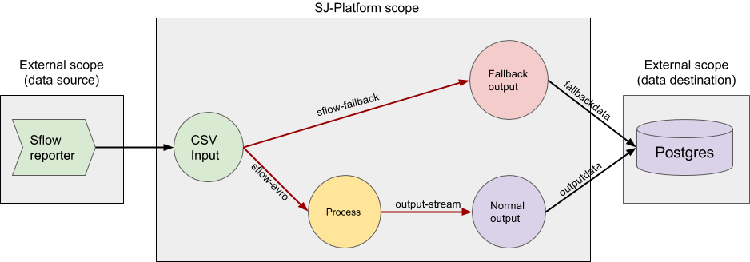

# SJ Sflow Demo



There is a diagram that demonstrates the processing workflow of demo that is responsible for collecting of sflow information.
Green, yellow, purple and red blocks are executed with SJ-Platform and it is *'sflow-csv-input'* module, *'sflow-process'*
module *'sflow-src-ip-output'* and *'sflow-src-dst-output'* modules and *'sflow-fallback-output'* module, respectively.

The data come in input module from some sflow reporter, that sends a sflow records in CSV format to input module.
Then the input module parses CSV-lines into avro records and puts parsed data into *'sflow-avro'*.
After that the process module parses avro record into sflow record, and then:
- computes traffic for source IP and puts its in *'src-ip-stream'*;
- computes traffic for source and destination and puts its in *'src-dst-stream'*.

Finally the *'sflow-src-ip-output'* module just displace data from *'src-ip-stream'* to table *'srcipdata'* in PostgreSQL.
The *'sflow-src-dst-output'* module does the same for *'src-ip-stream'* and table *'srcdstdata'*.
 
If the input module cannot parse an input line, then it puts data into *'sflow-fallback'*.
After that the fallback-output module move that incorrect line from *'sflow-fallback'* to table *'fallbackdata'* in PostgreSQL.


## Table of contents

- [Prerequisites](#prerequisites)
- [Installation](#installation)
- [Preparation](#preparation)
    * [Providers creation](#providers-creation)
    * [Output SQL tables creation](#output-sql-tables-creation)
    * [Services creation](#services-creation)
    * [Streams creation](#streams-creation)
    * [Instances creation](#instances-creation)
- [Launching](#launching)
- [Shutdown](#shutdown)
- [See the results](#see-the-results)


## Prerequisites

- Running [SJ Platform](https://github.com/bwsw/sj-platform)
- [SBT](http://www.scala-sbt.org/)


## Installation

To configure environment

```bash
address=<host>:<port>
```

- *\<host\>:\<port\>* &mdash; SJ Rest host and port.

To build and upload CSV-input module

```bash
git clone https://github.com/bwsw/sj-platform.git
cd sj-platform
sbt sj-csv-input/assembly
curl --form jar=@contrib/sj-platform/sj-csv-input/target/scala-2.12/sj-csv-input-1.0-SNAPSHOT.jar http://$address/v1/modules
cd -
```

To build and upload all modules of sflow demo

```bash
git clone https://github.com/bwsw/sj-sflow-demo.git
cd sj-sflow-demo
sbt assembly
curl --form jar=@sflow-process/target/scala-2.12/sflow-process-1.0.jar http://$address/v1/modules
curl --form jar=@sflow-output/src-ip/target/scala-2.12/sflow-src-ip-output-1.0.jar http://$address/v1/modules
curl --form jar=@sflow-output/src-dst/target/scala-2.12/sflow-src-dst-output-1.0.jar http://$address/v1/modules
curl --form jar=@sflow-fallback-output/target/scala-2.12/sflow-fallback-output-1.0.jar http://$address/v1/modules
```

To upload GeoIP database (required for process module)

```bash
curl "http://download.maxmind.com/download/geoip/database/asnum/GeoIPASNum.dat.gz" -O
gunzip GeoIPASNum.dat.gz
curl --form file=@GeoIPASNum.dat http://$address/v1/custom/files
curl --request POST "http://$address/v1/config/settings" -H 'Content-Type: application/json' --data "{\"name\": \"geo-ip-as-num\",\"value\": \"GeoIPASNum.dat\",\"domain\": \"system\"}"
```


## Preparation

### Providers creation

Before creation providers you should replace next placeholders in [api-json/providers](api-json/providers):
*\<login\>*, *\<password\>*, *\<host\>* and *\<port\>*. Remove *"login"* and *"password"* fields if you not need 
authentication to appropriate server. 

To create providers

```bash
curl --request POST "http://$address/v1/providers" -H 'Content-Type: application/json' --data "@api-json/providers/cassandra-sflow-provider.json" 
curl --request POST "http://$address/v1/providers" -H 'Content-Type: application/json' --data "@api-json/providers/jdbc-sflow-provider.json" 
curl --request POST "http://$address/v1/providers" -H 'Content-Type: application/json' --data "@api-json/providers/zookeeper-sflow-provider.json" 
```


### Output SQL tables creation

SQL tables for output must be created in database *sflow*. To create tables

```sql
CREATE TABLE srcipdata (
    id VARCHAR(255) PRIMARY KEY,
    src_ip VARCHAR(32),
    traffic INTEGER,
    txn BIGINT
);

CREATE TABLE srcdstdata (
    id VARCHAR(255) PRIMARY KEY,
    src_as INTEGER,
    dst_as INTEGER,
    traffic INTEGER,
    txn BIGINT
);

CREATE TABLE fallbackdata (
    id VARCHAR(255) PRIMARY KEY,
    line VARCHAR(255),
    txn BIGINT
);
```


### Services creation

To create services

```bash
curl --request POST "http://$address/v1/services" -H 'Content-Type: application/json' --data "@api-json/services/cassandra-sflow-service.json"
curl --request POST "http://$address/v1/services" -H 'Content-Type: application/json' --data "@api-json/services/jdbc-sflow-service.json"
curl --request POST "http://$address/v1/services" -H 'Content-Type: application/json' --data "@api-json/services/tstream-sflow-service.json"
curl --request POST "http://$address/v1/services" -H 'Content-Type: application/json' --data "@api-json/services/zookeeper-sflow-service.json"
```

### Streams creation

Now you should create streams that will be used in the instances of input, process, output and fallback-output modules.

To create an output streams of input module
```bash
curl --request POST "http://$address/v1/streams" -H 'Content-Type: application/json' --data "@api-json/streams/sflow-avro.json"
curl --request POST "http://$address/v1/streams" -H 'Content-Type: application/json' --data "@api-json/streams/sflow-fallback.json"
```

- *sflow-avro* &mdash; stream for correctly parsed sflow records;
- *sflow-fallback* &mdash; stream for incorrect inputs.

To create output streams of process module that will be used for keeping an information about source and destination
ip addresses and traffic

```bash
curl --request POST "http://$address/v1/streams" -H 'Content-Type: application/json' --data "@api-json/streams/src-ip-stream.json"
curl --request POST "http://$address/v1/streams" -H 'Content-Type: application/json' --data "@api-json/streams/src-dst-stream.json"
```

To create output streams of output module that will be used for storing an information to database 

```bash
curl --request POST "http://$address/v1/streams" -H 'Content-Type: application/json' --data "@api-json/streams/src-ip-data.json"
curl --request POST "http://$address/v1/streams" -H 'Content-Type: application/json' --data "@api-json/streams/src-dst-data.json"
```

To create an output stream of fallback-output module hat will be used for storing an incorrect inputs to database 

```bash
curl --request POST "http://$address/v1/streams" -H 'Content-Type: application/json' --data "@api-json/streams/fallback-data.json"
```


### Instances creation

To create an instance of input module

```bash
curl --request POST "http://$address/v1/modules/input-streaming/com.bwsw.input.csv/1.0/instance" -H 'Content-Type: application/json' --data "@api-json/instances/sflow-csv-input.json" 
```

To create an instance of process module

```bash
curl --request POST "http://$address/v1/modules/batch-streaming/sflow-process/1.0/instance" -H 'Content-Type: application/json' --data "@api-json/instances/sflow-process.json"
```

To create instances of output module

```bash
curl --request POST "http://$address/v1/modules/output-streaming/sflow-src-ip-output/1.0/instance" -H 'Content-Type: application/json' --data "@api-json/instances/sflow-src-ip-output.json"
curl --request POST "http://$address/v1/modules/output-streaming/sflow-src-dst-output/1.0/instance" -H 'Content-Type: application/json' --data "@api-json/instances/sflow-src-dst-output.json"
```

To create an instance of fallback output module

```bash
curl --request POST "http://$address/v1/modules/output-streaming/sflow-fallback-output/1.0/instance" -H 'Content-Type: application/json' --data "@api-json/instances/sflow-fallback-output.json"
```

## Launching

Now you can launch every module.

To launch input module

```bash
curl --request GET "http://$address/v1/modules/input-streaming/com.bwsw.input.csv/1.0/instance/sflow-csv-input/start"
```

To launch process module
```bash
curl --request GET "http://$address/v1/modules/batch-streaming/sflow-process/1.0/instance/sflow-process/start"
```

To launch output module

```bash
curl --request GET "http://$address/v1/modules/output-streaming/sflow-src-ip-output/1.0/instance/sflow-src-ip-output/start"
curl --request GET "http://$address/v1/modules/output-streaming/sflow-src-dst-output/1.0/instance/sflow-src-dst-output/start"
```

To launch fallback output module
```bash
curl --request GET "http://$address/v1/modules/output-streaming/sflow-fallback-output/1.0/instance/sflow-fallback-output/start"
```

To get a list of listening ports of input module

```bash
curl --request GET "http://$address/v1/modules/input-streaming/com.bwsw.input.csv/1.0/instance/sflow-csv-input"
```

and look at field named tasks, e.g. it will look like

```json
"tasks": {
  "sflow-csv-input-task0": {
    "host": "176.120.25.19",
    "port": 31000
  }
}
```

And now you can start the flow (replace *\<host\>* and *\<port\>* by values from gotten JSON):

```bash
for line in $(cat sflow_example.csv); do echo $line | nc <host> <port>; done
```


## Shutdown

To stop the input module

```bash
curl --request GET "http://$address/v1/modules/input-streaming/com.bwsw.input.csv/1.0/instance/sflow-csv-input/stop"
```

To stop the process module

```bash
curl --request GET "http://$address/v1/modules/batch-streaming/sflow-process/1.0/instance/sflow-process/stop"
```

To stop the output module

```bash
curl --request GET "http://$address/v1/modules/output-streaming/sflow-src-ip-output/1.0/instance/sflow-src-ip-output/stop"
curl --request GET "http://$address/v1/modules/output-streaming/sflow-src-dst-output/1.0/instance/sflow-src-dst-output/stop"
```

To stop the fallback-output module

```bash
curl --request GET "http://$address/v1/modules/output-streaming/sflow-fallback-output/1.0/instance/sflow-fallback-output/stop"
```


## See the results

To see a results execute query in database: 

```sql
SELECT * FROM srcipdata;
SELECT * FROM srcdstdata;
SELECT * FROM fallbackdata;
```

You should see something like this:

```
                  id                  |   src_ip    | src_as |   dst_ip    | dst_as | traffic |        txn        
--------------------------------------+-------------+--------+-------------+--------+---------+-------------------
 6bbf7db3-c7df-4160-ad7c-f0a36a78bea2 | 66.77.88.99 |    209 | 44.33.22.11 |   7377 |  172500 | 14911978205550000
 c5497904-3f6d-4987-b935-d6dca12a1677 | 11.22.33.44 |      0 | 44.33.22.11 |   7377 |  172500 | 14911978205550000
(2 rows)

                  id                  |                      line                       |        txn        
--------------------------------------+-------------------------------------------------+-------------------
 31652ea0-7437-4c48-990c-22ceab50d6af | 1490234369,sfr6,10.11.12.13,4444,5555,INCORRECT | 14911974375950000
(1 row)
```
